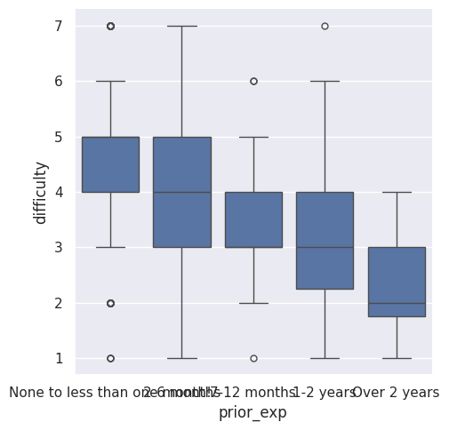
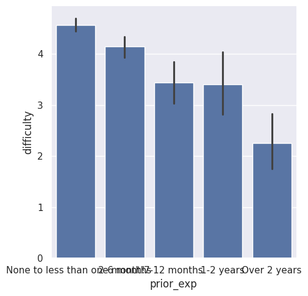
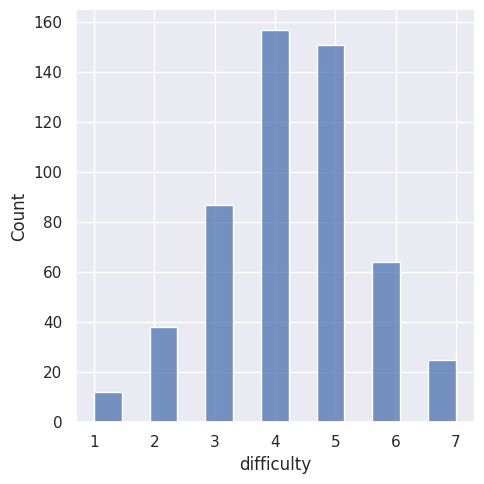

---
# Do not edit the text between these lines!
layout: default
---

# EX09

<!-- This is a comment. Below, you'll see code for inserting an image. To make this image appear, update <custom-path>. To add an image, save it inside the imgs folder of this repository. -->

**This box plot shows how difficulty scores vary for each level of prior experience. From left to right on the x axis the categories are, None to less than one month!, 2-6 months, 7-12 months, 1-2 years, Over 2 years**

**This bar plot shows the relationship between prior programming experience and how difficult students find the course. From left to right on the x axis the categories are, None to less than one month!, 2-6 months, 7-12 months, 1-2 years, Over 2 years**

**This histogram shows how difficulty ratings are distributed across all students.**

## Conclusion

The analysis suggests that students with more prior programming experience tend to find COMP110 less difficult. The visualizations show that students with little or no experience generally report higher difficulty levels, while students with more experience tend to report lower difficulty.

This supports the idea that prior experience plays a role in how challenging students perceive the course to be. However, there may be other factors influencing difficulty, such as study habits or use of resources like office hours.

A potential improvement based on this finding would be to provide additional support for students with little or no prior experience, such as extra practice problems or review sessions. One trade-off of this approach is that it may require additional time and resources from instructors and staff.
